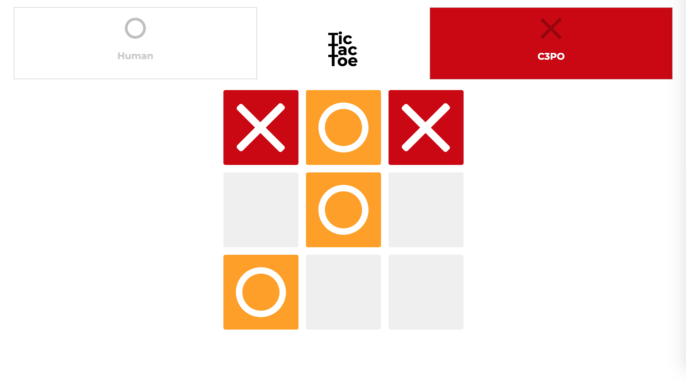
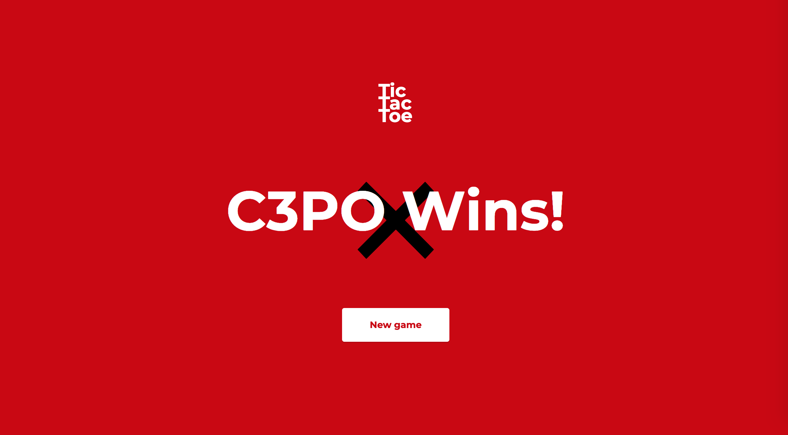
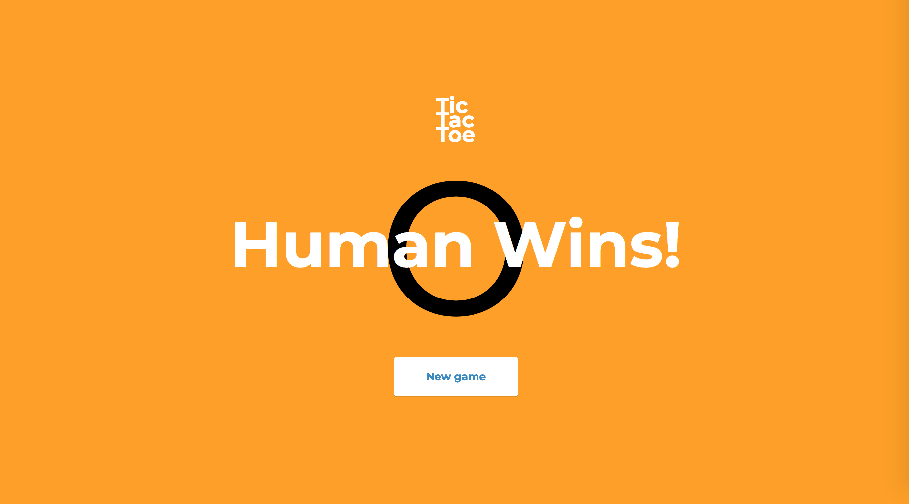

# Reverse Tic-Tac-Toe

A Tic-Tac-Toe web application written in pure vanilla Javascript. Can you manage to lose against the world's very first Artificial Lack-of-Intelligence?

## Features

- Supports 1P or 2P games

## How to play?

You can play a demo-version here: [Game Demo](https://eager-goldstine-5117ea.netlify.com)

## Screenshots

